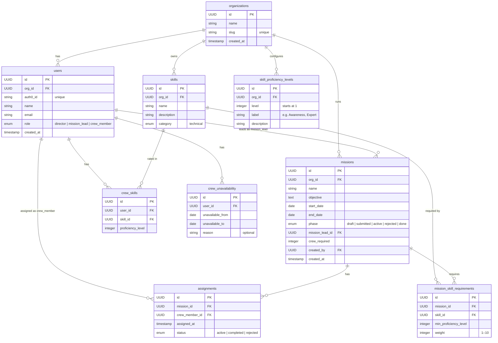
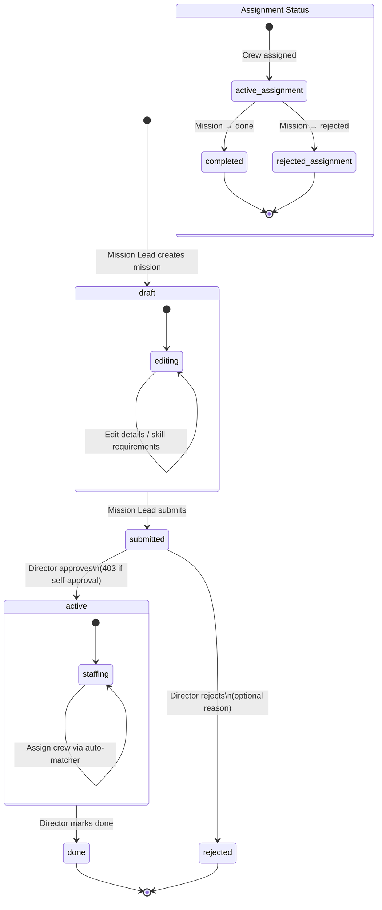
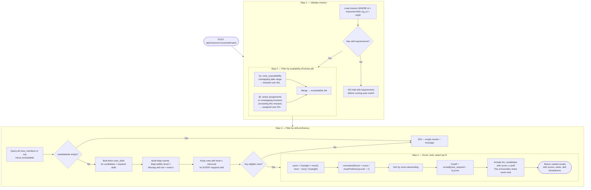
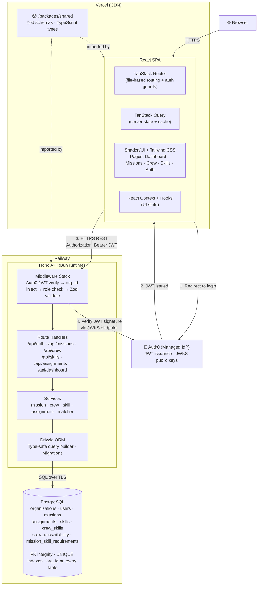

# Mission Control — System Diagrams

---

## 1. Entity Relationship Diagram

```mermaid
erDiagram
    organizations ||--o{ users : "has"
    organizations ||--o{ skills : "owns"
    organizations ||--o{ skill_proficiency_levels : "configures"
    organizations ||--o{ missions : "runs"

    users ||--o{ crew_skills : "has"
    users ||--o{ crew_unavailability : "has"
    users ||--o{ assignments : "assigned as crew_member"
    users ||--o{ missions : "leads as mission_lead"

    skills ||--o{ crew_skills : "rated in"
    skills ||--o{ mission_skill_requirements : "required by"

    missions ||--o{ mission_skill_requirements : "requires"
    missions ||--o{ assignments : "has"

    organizations {
        UUID id PK
        string name
        string slug "unique"
        timestamp created_at
    }

    users {
        UUID id PK
        UUID org_id FK
        string auth0_id "unique"
        string name
        string email
        enum role "director | mission_lead | crew_member"
        timestamp created_at
    }

    skills {
        UUID id PK
        UUID org_id FK
        string name
        string description
        enum category "technical"
    }

    skill_proficiency_levels {
        UUID id PK
        UUID org_id FK
        integer level "starts at 1"
        string label "e.g. Awareness, Expert"
        string description
    }

    crew_skills {
        UUID id PK
        UUID user_id FK
        UUID skill_id FK
        integer proficiency_level
    }

    crew_unavailability {
        UUID id PK
        UUID user_id FK
        date unavailable_from
        date unavailable_to
        string reason "optional"
    }

    missions {
        UUID id PK
        UUID org_id FK
        string name
        text objective
        date start_date
        date end_date
        enum phase "draft | submitted | active | rejected | done"
        UUID mission_lead_id FK
        integer crew_required
        UUID created_by FK
        timestamp created_at
    }

    mission_skill_requirements {
        UUID id PK
        UUID mission_id FK
        UUID skill_id FK
        integer min_proficiency_level
        integer weight "1–10"
    }

    assignments {
        UUID id PK
        UUID mission_id FK
        UUID crew_member_id FK
        timestamp assigned_at
        enum status "active | completed | rejected"
    }
```

---

## 2. Mission Lifecycle State Diagram

```mermaid
stateDiagram-v2
    [*] --> draft : Mission Lead creates mission

    draft --> submitted : Mission Lead submits
    submitted --> active : Director approves\n(403 if self-approval)
    submitted --> rejected : Director rejects\n(optional reason)
    active --> done : Director marks done

    state draft {
        [*] --> editing
        editing --> editing : Edit details / skill requirements
    }

    state active {
        [*] --> staffing
        staffing --> staffing : Assign crew via auto-matcher
    }

    state "Assignment Status" as AS {
        [*] --> active_assignment : Crew assigned
        active_assignment --> completed : Mission → done
        active_assignment --> rejected_assignment : Mission → rejected
        completed --> [*]
        rejected_assignment --> [*]
    }

    done --> [*]
    rejected --> [*]
```

---

## 3. Auto-Matcher Flow

```mermaid
flowchart TD
    Start([POST /api/missions/:missionId/match]) --> S1

    subgraph S1["Step 1 — Validate mission"]
        A[Load mission WHERE id = missionId AND org_id = orgId]
        A --> B{Has skill requirements?}
        B -- No --> ERR422[422 Add skill requirements\nbefore running auto-match]
        B -- Yes --> S2
    end

    subgraph S2["Step 2 — Filter by availability (Promise.all)"]
        C["2a: crew_unavailability\noverlapping date range\n→ blocked user IDs"]
        D["2b: active assignments\non overlapping missions\n(excluding this mission)\n→ assigned user IDs"]
        C --> E[Merge → excludedIds Set]
        D --> E
    end

    S2 --> S3

    subgraph S3["Step 3 — Filter by skill proficiency"]
        F[Query all crew_members in org\nminus excludedIds]
        F --> G{candidateIds empty?}
        G -- Yes --> EMPTY[200 — empty results + message]
        G -- No --> H[Bulk-fetch crew_skills\nfor candidates × required skills]
        H --> I["Build Map&lt;userId, Map&lt;skillId, level&gt;&gt;\nMissing skill row = level 0"]
        I --> J[Keep crew with level ≥ minLevel\nfor EVERY required skill]
        J --> K{Any eligible crew?}
        K -- No --> EMPTY
        K -- Yes --> S4
    end

    subgraph S4["Step 4 — Score, rank, select top N"]
        L["score = Σ(weight × max(0, level − min)) / Σ(weight)"]
        L --> M["normalizedScore = score / (maxProficiencyLevel − 1)"]
        M --> N[Sort by score descending]
        N --> O["Cutoff = scored[crew_required − 1].score"]
        O --> P[Include ALL candidates with score ≥ cutoff\nTies at boundary share same rank]
        P --> Result([Return ranked results\nwith scores, ranks, skill breakdowns])
    end
```

---

## 4. System Architecture

```mermaid
flowchart TD
    Browser["🌐 Browser"]

    subgraph Vercel["Vercel (CDN)"]
        subgraph SPA["React SPA"]
            Router["TanStack Router\n(file-based routing + auth guards)"]
            Query["TanStack Query\n(server state + cache)"]
            UI["Shadcn/UI + Tailwind CSS\nPages: Dashboard · Missions · Crew · Skills · Auth"]
            UIState["React Context + Hooks\n(UI state)"]
        end
        Shared["📦 /packages/shared\nZod schemas · TypeScript types"]
    end

    subgraph Railway["Railway"]
        subgraph Server["Hono API (Bun runtime)"]
            MW["Middleware Stack\nAuth0 JWT verify → org_id inject → role check → Zod validate"]
            Routes["Route Handlers\n/api/auth · /api/missions · /api/crew\n/api/skills · /api/assignments · /api/dashboard"]
            Services["Services\nmission · crew · skill · assignment · matcher"]
            ORM["Drizzle ORM\nType-safe query builder · Migrations"]
        end
        DB[("PostgreSQL\norganizations · users · missions\nassignments · skills · crew_skills\ncrew_unavailability · mission_skill_requirements\n\nFK integrity · UNIQUE indexes · org_id on every table")]
    end

    Auth0["🔐 Auth0 (Managed IdP)\nJWT issuance · JWKS public keys"]

    Browser -->|"HTTPS"| SPA
    SPA -->|"1. Redirect to login"| Auth0
    Auth0 -->|"2. JWT issued"| SPA
    SPA -->|"3. HTTPS REST\nAuthorization: Bearer JWT"| MW
    MW -->|"4. Verify JWT signature\nvia JWKS endpoint"| Auth0
    MW --> Routes
    Routes --> Services
    Services --> ORM
    ORM -->|"SQL over TLS"| DB
    Shared -.->|"imported by"| SPA
    Shared -.->|"imported by"| Server
```
